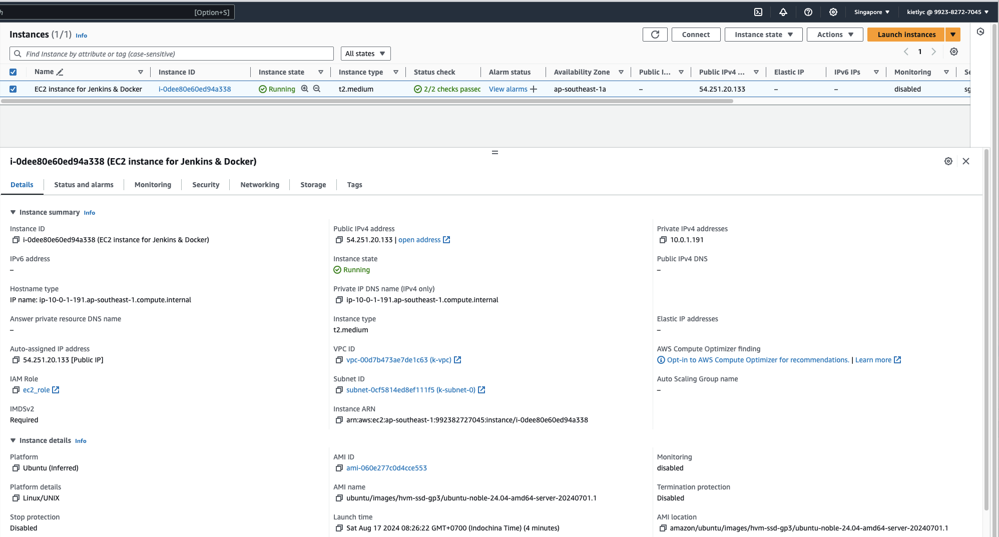

# Terraform

## Check Components on UI

### VPC Overview


#### Subnets


### EKS Clusters

#### EKS Overviews


#### EKS VPC


#### EKS Plugin


### EC2 instance for Jenkins

#### EC2 Overview



#### Docker CLI, AWS CLI and Kubectl installed

```shell
ubuntu@ip-10-0-1-191:~$ aws --version
aws-cli/2.17.32 Python/3.11.9 Linux/6.8.0-1009-aws exe/x86_64.ubuntu.24
ubuntu@ip-10-0-1-191:~$ docker --version
Docker version 27.1.2, build d01f264
ubuntu@ip-10-0-1-191:~$ kubectl version
Client Version: v1.31.0
Kustomize Version: v5.4.2
```

#### Jenkins installed and running


### ECR


### Security Group


### IAM Roles


# Jenkins

## Secrets confignfiguration


## Continuous Integration

### Frontend

#### Check for unit test

#### New version indicator pushed to the repository

#### New Docker image pushed to the ECR

### Back end

#### Check for unit test

#### New version indicator pushed to the repository

#### New Docker image pushed to the ECR

## Continuous Delivery

### Using Jenkins

#### Jenkins - Githook apply the K8S deployment when code pushed to master branch

### Using Argo CD

#### Apply the K8S when code pushed to master branch

# Prometheus & Grafana (Using Community Helms)

## Prometheus

## Grafana

# Miscellaneous

#### EKS - CSI Driver

### Jenkins Execution Log

#### CI Frontend

#### CI Backend

#### CD Frontend

#### CD Backend
